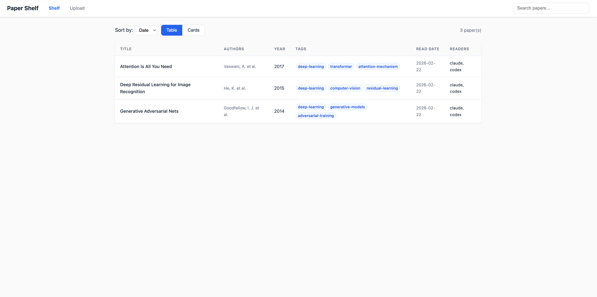
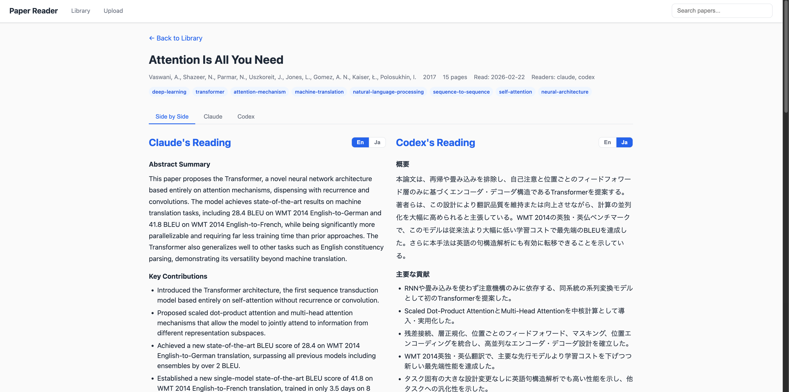
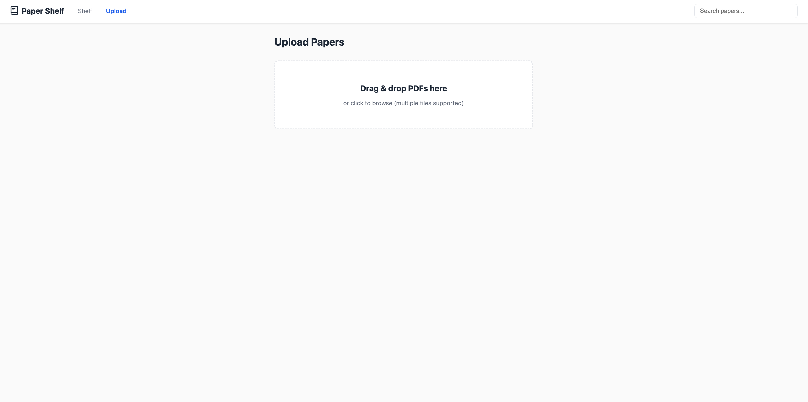

# Paper Shelf

A personal academic paper library powered by LLMs. Upload PDFs and let Claude and Codex read them for you — generating structured, bilingual (English/Japanese) summaries with a web UI.

## Features

- **Multi-LLM reading** — Claude and OpenAI Codex read your papers independently, enabling side-by-side comparison
- **Bilingual output** — Every section (abstract, methodology, results, etc.) is generated in both English and Japanese with a one-click Ja/En toggle
- **Critical analysis** — AI-generated critique identifying assumptions, weaknesses, and unverified claims
- **Paper discovery** — Find related papers and library-wide recommendations powered by [OpenAlex](https://openalex.org/)
- **Web UI** — Browse your library, upload papers, and view reading results through an intuitive interface
- **Shelves** — Organize papers into custom shelves with virtual auto-sorted shelves
- **PDF archive** — Source PDFs are saved alongside reading results for easy reference
- **CLI** — Full command-line interface for scripting and automation
- **Structured storage** — Results saved as both JSON (machine-readable) and Markdown (human-readable)

## Screenshots





## Quick Start

### Prerequisites

- Python 3.11+
- Node.js 18+ (for building the frontend)
- [Claude Code CLI](https://docs.anthropic.com/en/docs/claude-code) (`npm install -g @anthropic-ai/claude-code`)
- [OpenAI Codex CLI](https://github.com/openai/codex) (`npm install -g @openai/codex`) — optional

### Installation

```bash
git clone https://github.com/cohsh/paper-shelf.git
cd paper-shelf
pip install -e ".[dev]"
cd web && npm install && npm run build && cd ..
```

### Usage

#### Web UI

```bash
paper-shelf serve
# Open http://localhost:8000
```

Upload PDFs via the web interface, choose a reader (Claude / Codex / Both), and browse your library.

#### CLI

```bash
# Read a paper
paper-shelf read paper.pdf

# Read with a specific reader
paper-shelf read paper.pdf --reader claude

# List papers in your library
paper-shelf list

# Search papers
paper-shelf search "quantum"

# Show a paper's reading
paper-shelf show <paper-id>
```

### Development

```bash
# Backend
paper-shelf serve --dev

# Frontend (separate terminal)
cd web && npm run dev
```

The frontend dev server runs at `http://localhost:5173` with API proxy to the backend.

### Tests

```bash
pytest
```

## Architecture

```
paper-shelf/
├── src/
│   ├── main.py              # CLI entry point (Click)
│   ├── pdf_extractor.py      # PDF text extraction (PyMuPDF)
│   ├── reader_claude.py      # Claude Code CLI integration
│   ├── reader_codex.py       # OpenAI Codex CLI integration
│   ├── storage.py            # JSON + Markdown storage
│   ├── library.py            # Library index management
│   ├── discovery.py          # Paper discovery via OpenAlex API
│   ├── exceptions.py         # Exception hierarchy
│   └── server/               # FastAPI backend
│       ├── app.py            # App factory, static file serving
│       ├── routes_papers.py  # Paper CRUD + PDF serving
│       ├── routes_upload.py  # Upload + background task management
│       ├── routes_discovery.py # Paper discovery endpoints
│       └── tasks.py          # Background reading pipeline
├── web/                      # React + TypeScript frontend (Vite)
├── prompts/                  # LLM prompt templates and JSON schema
├── library/                  # Output directory (gitignored)
│   ├── json/                 # Structured reading results
│   ├── markdown/             # Human-readable summaries
│   └── pdfs/                 # Archived source PDFs
└── tests/                    # pytest test suite
```

## How It Works

1. **Extract** — PyMuPDF extracts text from the uploaded PDF
2. **Read** — Claude and/or Codex analyze the paper using a structured prompt, producing bilingual JSON output
3. **Store** — Results are saved as JSON + Markdown, source PDF is archived
4. **Critique** — Claude generates a critical analysis of the paper's assumptions, weaknesses, and applications
5. **Discover** — OpenAlex API finds related papers based on your library
6. **Browse** — View, search, and compare readings through the web UI or CLI

## Powered by

- **[Claude Code](https://claude.com/claude-code)** (Anthropic) — Paper reading, critical analysis, and search query generation, using Claude Sonnet 4
- **[OpenAI Codex CLI](https://github.com/openai/codex)** — Optional second reader for comparison
- **[OpenAlex](https://openalex.org/)** — Open scholarly metadata for paper discovery and related paper recommendations. OpenAlex data is licensed under [CC0](https://creativecommons.org/publicdomain/zero/1.0/)

## Development Note

This project was built entirely with [Claude Code](https://claude.com/claude-code) (Claude Opus 4.6).

## License

MIT
